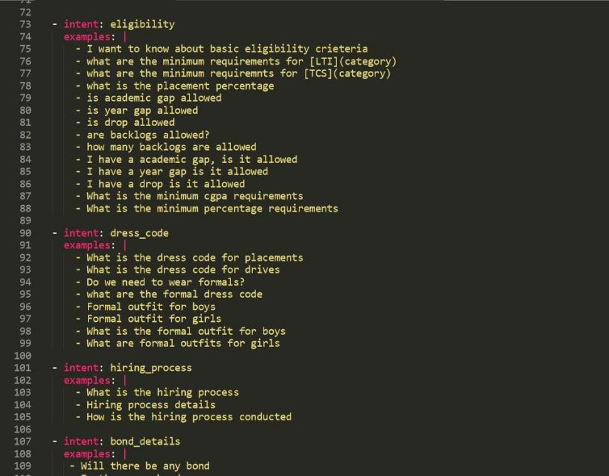
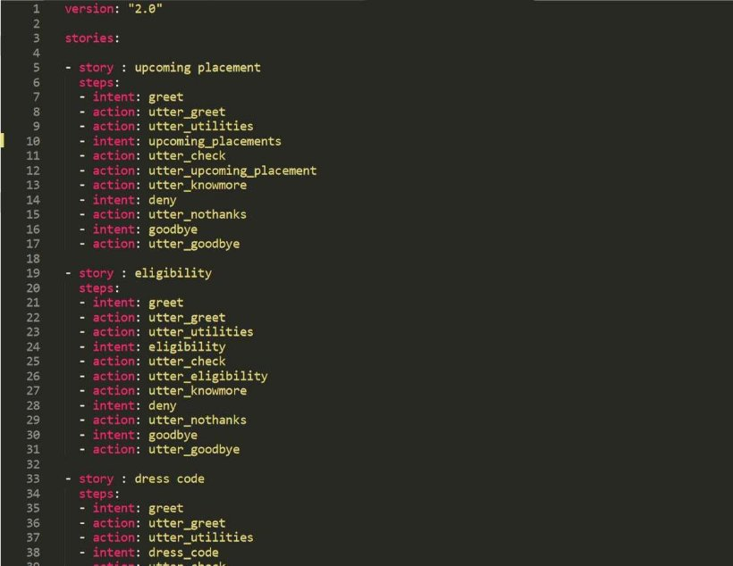
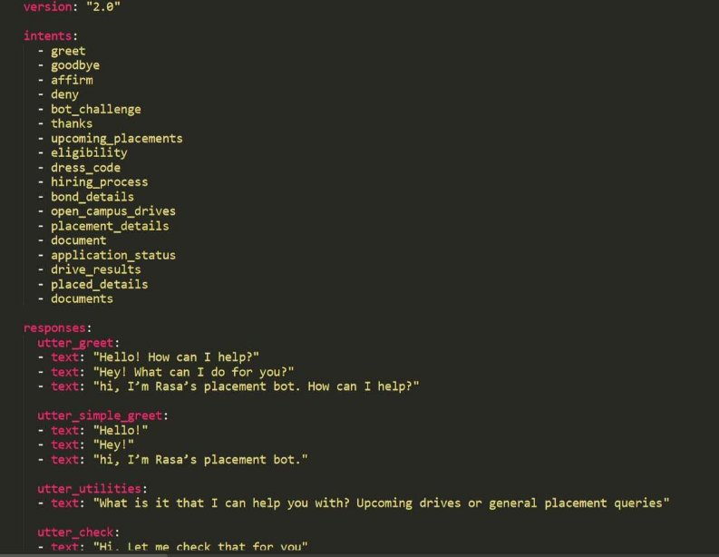

### Placement Assistant Chatbot

Sanjana Nalawade (171040) Himanshu Raut (171040) Sahil Naik (17104054)

### Contents

- Introduction
- Objectives
- Problem Definition
- Technological Stack
- Static Block Diagram
- Snapshots of application
- Conclusion

### Introduction

- Keeping track of placement opportunities and knowing as much as possible about the details is something every aspirant does in the recruitment season.
- They might look up the company websites, employer reviews, work environment and their own eligibility for the job through multiple sources with no guarantee of authenticity.
- Some might even try to contact their TPO offices but they may not be available to attend every student and answer every question.
- This is where Placement Assistant Chatbot comes into picture. With information fed from reliable sources, the assistant would help with every query regarding placements and related questions.
- From details about company eligibility criteria to past year records, Placement Assistant Chatbot would have all the data one would ever need.
- Using this chatbot, students would have all the related questions answered in an instant without having to look up through multiple sources which might or might not be reliable.

### Objectives:

- To provide assistance regarding placements to students.
- To provide information about upcoming drives
- FAQ’s in a chatbot format

### Problem Definition:

- Students having to look up for companies and criteria on their own with no fixed source of information and then bombarding their Training and Placement officers with their queries.
- Members of TPO having to answer redundant questions of a number of students which might not be always possible.

### Technological Stack:

 Rasa

 Python

### StaticDiagram:

### Snapshot of Application 

Intents

Stories

Domain

### Conclusion

- In this project we have achieved the main objective which is to provide assistance regarding placement opportunities to interested students also keep a track of past placement drives. It is designed to assist aspirants with all the necessary information and details needed for any particular job opportunity. We have have provided out chat-bot with as much data as possible to make it an impactful and easy to use software.

Thank You.

